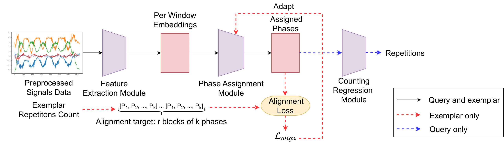

# CaRaCount
This repository contains the official code and data for [Class-Agnostic Repetitive Action Counting Using Wearable Devices](https://github.com/bbvisual/CaRaCount) (TPAMI2025).


## Overview
We introduce **CaRaCount**, a **class-agnostic**, **few-shot** approach for repetitive action counting using **wearable sensor data**. Unlike existing methods that require extensive training data and predefined action classes, **CaRaCount** can accurately count repetitions of any action using only a short exemplar sequence. To support this research, we also present the **CaRa dataset**, a large-scale multivariate time-series dataset collected from smartwatches, encompassing **50 action categories across 6 superclasses**.



## Installation
```bash
conda create -n caracount python=3.10
conda activate caracount
pip install torch
pip install numpy matplotlib pandas scikit-learn scipy
```

## Reference
If you find our code or papers useful for your research, please cite:
```
@article{duc_caracount_tpami_2025,
     title = {Class-Agnostic Repetitive Action Counting Using Wearable Devices},
    author = {Duc Duy Nguyen, Lam Thanh Nguyen, Yifeng Huang, Cuong Pham, Minh Hoai},
   journal = {IEEE Transactions on Pattern Analysis and Machine Intelligence (TPAMI)},
      year = {2025},
}

@inproceedings{yifeng_exrac_aaai_2024,
     title = {Count What You Want: Exemplar Identification and Few-Shot Counting of Human Actions in the Wild},
    author = { Yifeng Huang, Duc Duy Nguyen, Lam Thanh Nguyen, Cuong Pham, Minh Hoai},
 booktitle = {Proceedings of AAAI Conference on Artificial Intelligence (AAAI)},
      year = {2024}
}
```

## Contact
If you have any question, feel free to contact the author. 

Duc Duy Nguyen: ducduy.nguyen@adelaide.edu.au
